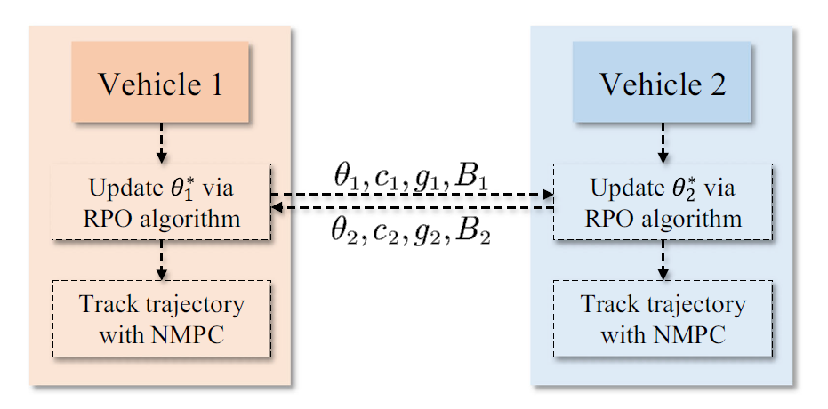

##### Abstract

**Cooperative rendezvous/docking** is an enabling technology for future autonomous missions. However, it is still a challenge to design a fully distributed, stability-guaranteed control method for cooperative rendezvous. To address this issue, this paper proposes a **distributed control method** for an unmanned vehicle cooperative rendezvous mission. First, the cooperative rendezvous process is formulated as an optimal control problem. To decentralize the control framework, a rendezvous parameter is introduced, and the **rendezvous parameter optimization algorithm** is designed to guarantee the terminal rendezvous of autonomous vehicles while improving the system performance. On this basis, a distributed control framework, based on rendezvous parameter optimization, generates the control commands to achieve cooperative rendezvous. Results demonstrate the effectiveness of the proposed distributed control approach through three simulations.

---

##### Distributed control approach based on rendezvous parameter optimization




---
##### Information
**Z. Wei**, Z. Shao, L.T. Biegler, “Distributed control method for vehicle cooperative rendezvous,” *Journal of Guidance, Control, and Dynamics*, 2025. DOI: 10.2514/1.G008445. [[Paper]](https://arc.aiaa.org/doi/abs/10.2514/1.G008445)


<!-- 


```BibTeX
@article{AAYY,
author = {Author 1 and Author 2},
doi = {paper_doi},
journal = {Journal},
number = {Issue},
pages = {XXX--YYY},
title ={Title},
volume = {Volume},
year = {Year}}
```

---

##### Related material

+ [Presentation slides](presentation2.pdf)
 -->
