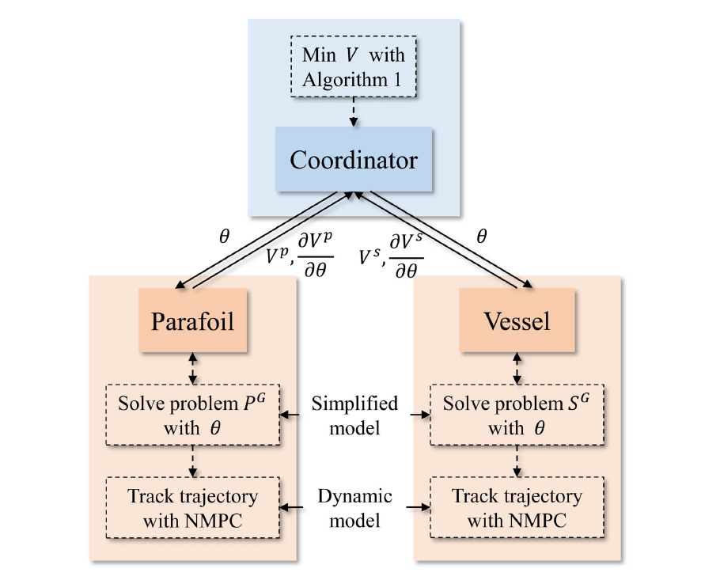

##### Abstract

Emerging recovery missions bring the need to **cooperatively recover**
the parafoil system with the vessel. However, the current literature
on the parafoil system focuses on the fixed-point landing, which
unavoidably hinders the flexibility of the recovery missions.To address
this issue, this article proposes a **distributed control algorithm** for the cooperative recovery of the parafoil system. First, the cooperative recovery process is formulated as a trajectory optimization problem based on the dynamics of the parafoil system and the vessel. To reduce the computation and transmission burden of the vehicles, the coordinated distributed control approach is designed, which incorporates the rendezvous point update algorithm to coordinate the two vehicles and the **nonlinear model predictive control** (NMPC) method to leverage the nonlinear dynamic model for the generation of control command. Simulation results demonstrate the effectiveness of the proposed coordinated distributed NMPC approach for the cooperative recovery of the parafoil system under disturbances.

---

##### Coordinated distributed NMPC approach




---
##### Information
**Z. Wei**, Z. Shao, L.T. Biegler, “Parafoil system cooperative recovery: A coordinated distributed NMPC approach,” IEEE Transactions on Aerospace and Electronic Systems, 2024. DOI: 10.1109/TAES.2024.3378193. [[Paper]](https://ieeexplore.ieee.org/document/10474175)


<!-- 


```BibTeX
@article{AAYY,
author = {Author 1 and Author 2},
doi = {paper_doi},
journal = {Journal},
number = {Issue},
pages = {XXX--YYY},
title ={Title},
volume = {Volume},
year = {Year}}
```

---

##### Related material

+ [Presentation slides](presentation2.pdf)
 -->
