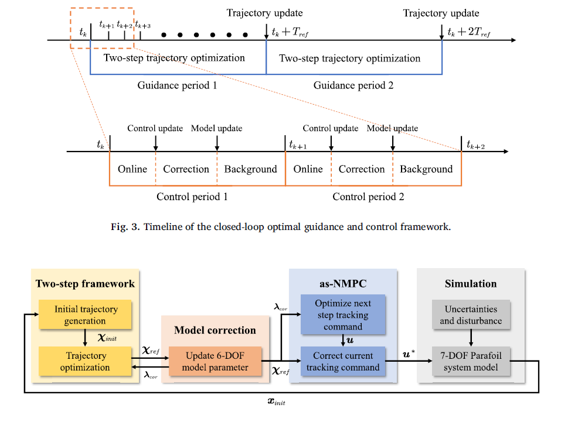

##### Abstract

Emerging payload delivery missions bring the need to improve the landing accuracy of the autonomous heavy parafoil system. However, traditional parafoil guidance and control algorithms are based on the simplified three-degree-of-freedom (3-DOF) kinematic model. This unavoidably deteriorates the terminal landing accuracy and hinders the flare maneuver. To address this issue, this work proposes a novel parafoil **guidance and control algorithm based on the six-degree-of-freedom (6-DOF) dynamic model**. Firstly, the parafoil terminal landing process is formulated as a 6-DOF trajectory optimization problem. To generate the terminal landing reference trajectory, a two-step trajectory optimization framework is introduced, which incorporates a trajectory initialization step to improve the computation efficiency of the following trajectory optimization step. On this basis, the guidance and control framework based on the 6-DOF parafoil system dynamic model is designed. In the proposed framework, the guidance trajectory is updated using a **receding-horizon** mechanism, the control command is generated through the advanced-step nonlinear model predictive control method, and the model inaccuracy is dealt with by the **moving horizon model correction** method. Simulation results demonstrate the effectiveness of the proposed dynamic-model-based guidance and control framework and its superior touchdown performance.

---

##### Dynamic-model-based parafoil guidance and control framework




---
##### Information
**Z. Wei**, Y Gao, Z. Shao, C. Wang, “Dynamic-model-based closed-loop guidance and control for heavy parafoil system precision landing,” *Aerospace Science and Technology*, 2024. DOI: 10.1016/j.ast.2024.108964. [[Paper]](https://www.sciencedirect.com/science/article/abs/pii/S127096382400097X)


<!-- 


```BibTeX
@article{AAYY,
author = {Author 1 and Author 2},
doi = {paper_doi},
journal = {Journal},
number = {Issue},
pages = {XXX--YYY},
title ={Title},
volume = {Volume},
year = {Year}}
```

---

##### Related material

+ [Presentation slides](presentation2.pdf)
 -->
