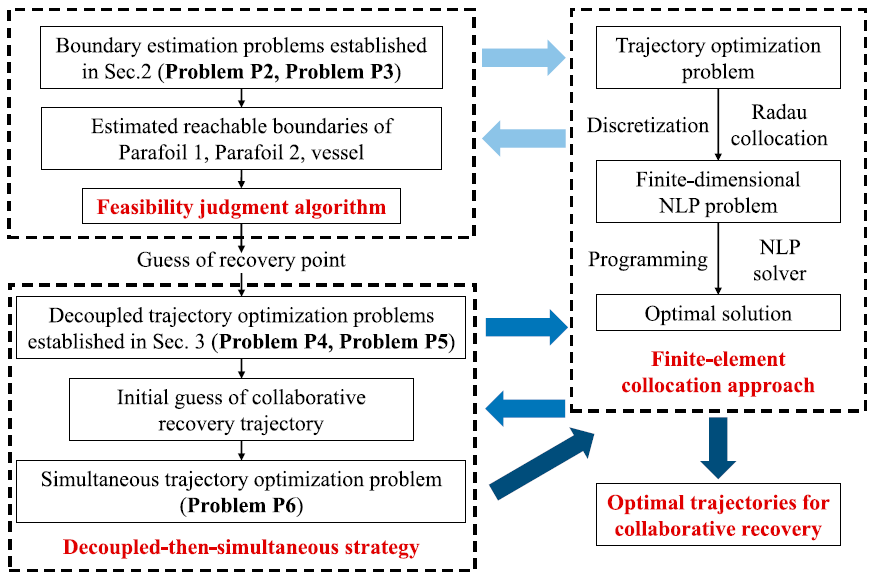

##### Abstract

Traditional trajectory optimization methods for the parafoil system set fixed-point landing as the objective. However, in recent payload fairing recovery missions, the recovery system comprising two parafoils is collaboratively recovered by a mobile vehicle, posing new challenges to the current trajectory optimization technique. In order to recover two parafoil systems autonomously with an unmanned surface vessel, this paper presents a trajectory optimization framework composed of three following component processes consecutively. Firstly, a feasibility judgment algorithm based on reachable boundary estimation is designed to determine the possibility of recovering two parafoil systems. Secondly, the decoupled-then-simultaneous strategy is proposed to enhance the convergence of solving the collaborative recovery problem. Thirdly, the finite-element collocation approach is utilized to convert the formulated trajectory optimization problems into nonlinear programming (NLP) problems, which are solved by a highly efficient NLP solver. Simulation results show that the proposed trajectory optimization framework can efficiently generate the optimal trajectory for recovering two parafoil systems with a vessel.

---

##### Iteration of adaptive bilevel decomposition strategy




---
##### Information
**Z. Wei**, K Chen, Z. Shao, “Trajectory optimization for collaborative recovery of parafoil systems using unmanned vessel,” Proceedings of the Institution of Mechanical Engineers, Part G: Journal of Aerospace Engineering, 2023. DOI: 10.1177/09544100231212647. [[Paper]](https://journals.sagepub.com/doi/10.1177/09544100231212647)


<!-- 


```BibTeX
@article{AAYY,
author = {Author 1 and Author 2},
doi = {paper_doi},
journal = {Journal},
number = {Issue},
pages = {XXX--YYY},
title ={Title},
volume = {Volume},
year = {Year}}
```

---

##### Related material

+ [Presentation slides](presentation2.pdf)
 -->
