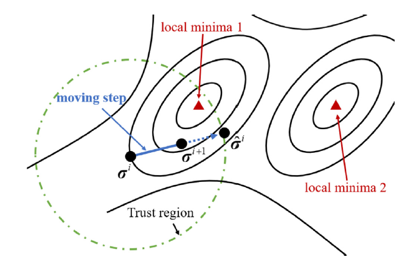

##### Abstract

The direct method has been widely used in various fields of trajectory optimization due to the need to optimize the performance of a controlled dynamic system. An essential issue in the development of the direct method is the selection of the finite element mesh. Although there have been many pieces of research on adaptive mesh refinement, few works focused on finite element layout optimization before the refinement. This paper proposes an enhanced moving finite element method (EMFE), taking the length of each finite element as a variable, based on the geometric estimation of non-collocationpoint error (NCPE) and generalized finite element length (GFEL). The features of EMFE include flexible problem reformulation, stable numerical calculation and the ability to locate breakpoints for singular control problems (the control variables appear linearly in the problems) and finding the local minimum numerical error. The theoretical basis of the ability to locate the breakpoints for singular control problems and the feature of NCPE estimate has also been investigated. Three numerical examples, two of which are singular control problems for lunar landing and the other is a multi-phase nonlinear problem for launch vehicles, demonstrated the performance and features of the proposed EMFE method.

---

##### Iteration of adaptive bilevel decomposition strategy




---
##### Information
**Z. Wei**, Y Gao, Z. Shao, C. Wang, “Dynamic-model-based closed-loop guidance and control for heavy parafoil system precision landing,” *Aerospace Science and Technology*, 2024. DOI: 10.1016/j.ast.2024.108964. [[Paper]](https://www.sciencedirect.com/science/article/abs/pii/S127096382400097X)


<!-- 


```BibTeX
@article{AAYY,
author = {Author 1 and Author 2},
doi = {paper_doi},
journal = {Journal},
number = {Issue},
pages = {XXX--YYY},
title ={Title},
volume = {Volume},
year = {Year}}
```

---

##### Related material

+ [Presentation slides](presentation2.pdf)
 -->
